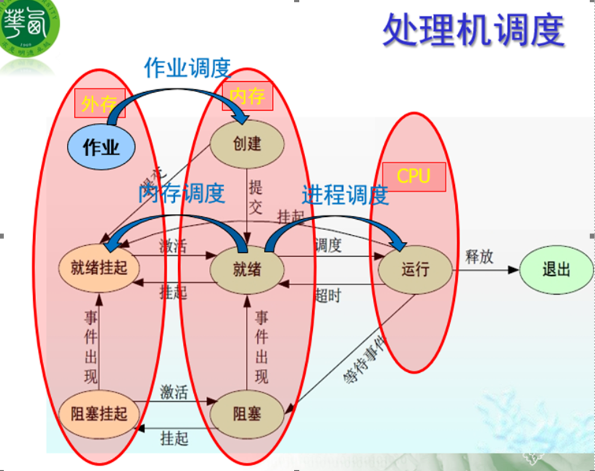
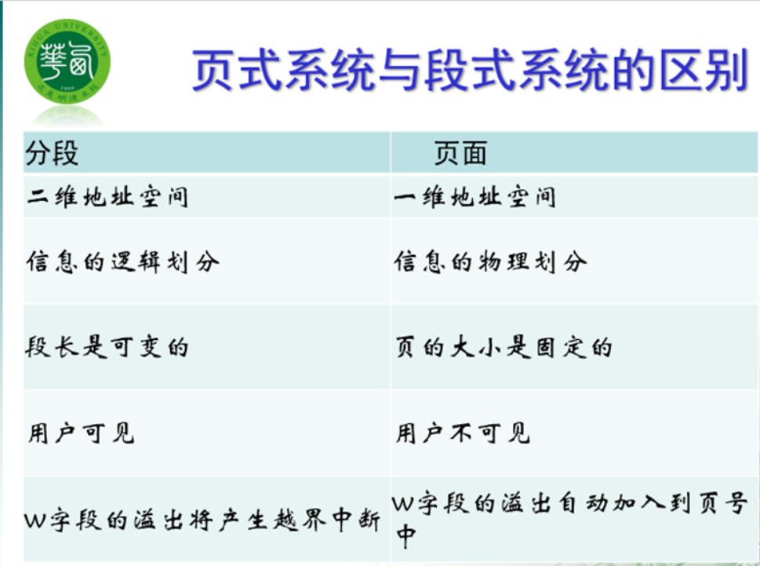
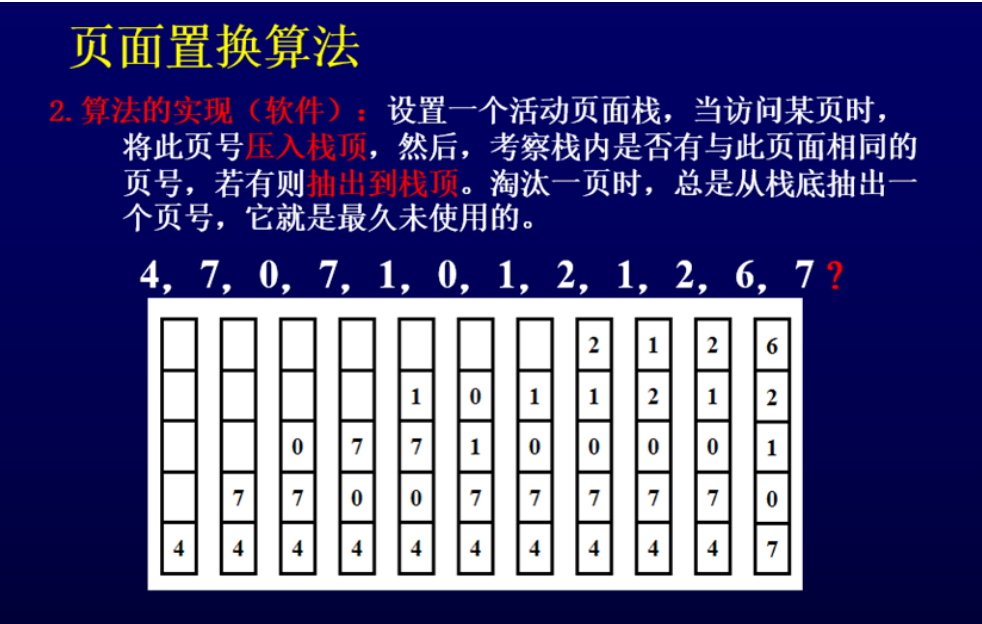
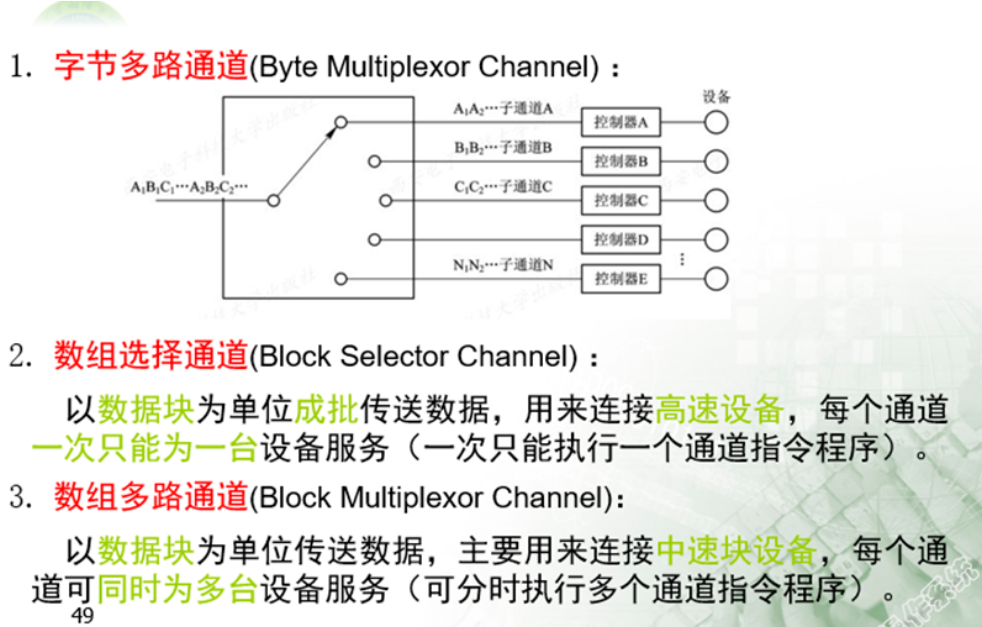
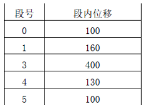

## 第一章 概述

##### 1、操作系统的概念、基本类型、基本特征及基本功能；

```
概念：os是核心系统软件，负责计算机系统、硬件资源的分配和使用；控制和协调并发活动；提供用户接口，使用户获得良好的工作环境
基本类型：
1.	批量操作系统：将用户提交的作业成批的送入计算机，然后由作业调度程序自动选择作业运行
2.	分时操作系统：采用时间片轮转的办法，使一台计算机同时为多个终端用户服务
3.	实时操作系统：对外部输入的信息，能在规定的时间内处理完毕并做出反应
4.	个人计算机操作系统：
5.	网络操作系统
6.	分布式操作系统：服务分布化

基本特征：并发、共享、虚拟、异步
并发：两或多个事件在同一时间间隔内发生
共享：指系统中资源可供内存中多个并发执行的进程共同使用
虚拟：通过某种技术把一个物理实体变为若干个逻辑上的对应物
异步（不确定性）：运行进度不可预知

基本功能：处理机管理、存储器管理、设备管理、文件系统管理。还有为用户使用操作系统提供了用户接口
```
##### 2、操作系统的结构设计方法； 

## 第二章 进程管理
##### 1、多道程序设计技术（多道程序设计技术是在计算机内存中同时存放几道相互独立的程序，使它们在管理程序控制下，相互穿插运行）；
##### 2、进程的概念、特征、基本状态及与程序的区别和联系；

```
概念：进程是指一个具有一定独立功能的程序关于某个数据集合的一次执行活动
特征：动态性，并发性，独立性，异步性
基本状态：就绪状态、运行状态、等待状态
就绪（进程调度）→运行（服务请求I/O）→等待状态（服务完成/ 事件来到）→就绪状态
```


##### 3、PCB 的概念、前趋图与进程图；

##### 4、原语的概念及进程控制原语的种类；

```
原语是操作系统中完成一些特定功能的、不可中断的过程

原语的种类： 
进程控制原语：
创建原语（分配PCB及资源）、撤销原语（撤销PCB并归还资源）、
阻塞原语（阻塞后的进程只能由其他进程唤醒）
唤醒原语（一般执行此语句的进程与被唤醒进程是合作的并发进程，唤醒原语的最后一步可以转进程调度，也可以返回现行进程）
```
##### 5、进程的同步与互斥的概念、临界资源与临界区的概念；
```
进程的同步：并发进程在一些关键点上可能需要互相等待与互通消息，这种相互制约的等待与互通消息称为进程的同步
```

进程的互斥：在操作系统中，当某一进程正在访问某一存储区域时，不允许其他进程来读出或者修改存储区的内容，否则就会发生后果无法估计的错误

临界资源：通常把一次仅允许一个进程使用的资源称为临界资源
临界区：进程访问临界资源的那段代码

```

```

##### 6、信号量及其应用；
##### 7、线程的概念及种类、引入线程的目的；
```
线程是进程内的一个相对独立的可调度的执行单元，一个进程可含有多个线程，它们可以并发执行，共享进程的全部资源。

引入线程的目的：减小程序在并发执行时所付出的时空开销，提高操作系统的并发性能。
```
## 第三章 处理机调度与死锁
##### 1、调度的层次与作用；
```
（1）高级调度（作业调度、长程调度、宏观调度）：
（2）低级调度（进程调度、短程调度）：
（3）中级调度（内存调度）：
```


##### 2、常用调度算法及计算；
```
作业调度算法：
先来先服务（FCFS）
短作业优先（SJF）
优先级调度算法（PSA）
高响应比优先调度算法（HRRN）

```
##### 3、死锁的概念、产生的原因及必要条件；
```
概念：一组并发进程彼此无休止地等待对方占用的资源，从而造成不能继续向前推进的状态，称为进程的死锁。
产生的原因：并发进程的资源竞争
（1）	由于多数资源是互斥地使用，有多个并发进程时系统资源不足
（2）	进程推进不合理
必要条件：互斥使用、不可强占、请求和保持、循环等待
（1）	互斥使用：进程应互斥使用资源，任意时刻一个资源仅为一个进程独占，若另一个进程请求一个已被占用的资源时，就把这个进程置成等待状态，知道占用者释放资源
（2）	不可强占：任一进程不能从另一进程那里抢夺资源
（3）	请求和保持：一个进程请求资源得不到满足而等待时，不释放已占有的资源
（4）	循环等待：存在一个循环等待链，其中，每一个进程分别等待它前一个进程所持有的资源，造成永远等待
```
##### 4、处理死锁的基本方法；
`预防死锁、避免死锁、检测死锁、解除死锁 `


##### 5、银行家算法及计算； 


## 第四章 存储管理
##### 1、存储管理的目的及功能；
```
存储管理的目的：解决多道作业的主存空间的动态分配问题，提高内存利用率并方便用户使用主存

存储管理的功能：地址映射、主存分配、主存保护、虚拟主存

```
##### 2、重定位的概念及方法；
```
重定位的概念：把逻辑地址转换为内存的物理地址的过程

方法：
静态重定位：在程序装入过程中、随即进行的地址变换，由装入软件完成
动态重定位：通过一个地址变换机构将虚地址变换为主存的物理地址，并且是在程序执行过程中执行的，需硬件支持
```
##### 3、内碎片与外碎片；
```
内碎片：分配给作业的存储空间中`未被利用的部分`
外碎片：系统中`无法利用`的小存储块
```
##### 4、常用分区分配算法及对应的空闲区排列方式；

```
首次适应算法：空闲区链表按地址从低到高排序，放入到主存中`第一个足够装入它的地址最低的空闲区。`
最佳适应算法：按大小从小到大排序，放到与它`大小最接近的空闲区。`
最坏适应算法：按大小从大到小排序，放到与它所需空间`差距最大的空闲区。`
```


##### 5、基本分页（分段、段页式）的概念、页（段）表的作用、地址变换；
```
分页式：
虚页：程序的地址空间被等分成大小相等的片，称为页面，又称为虚页。
实页：主存被等分成大小相等的片，称为主存块，又称为实页。
页表：为了实现从地址空间到物理主存的映象，系统建立的记录页与内存块之间对应关系的地址变换的机构称为页面映像表，简称页表。
分页系统中，地址变换主要通过页表来实现，故也叫地址变换表或地址映射表。
页表包括页号和块号。
虚地址结构包括：页号+页内位移。变换过程由操作系统完成。

分段式：
分段是程序中自然划分的一组逻辑意义完整的信息集合，如数据段、代码段、栈段。
分段式程序地址空间由若干个逻辑分段组成，每个分段有自己的名字，对于一个分段而言，它是一个连续的地址区。
段表包括段号长度和基址。
段式地址结构包括：段号+段内位移。
段页式：
在一个分段内划分页面就形成了段页式存储管理。
```
##### 6、分页与分段的区别、各自的优缺点；



##### 7、快表的作用、内存访问时间的计算；


##### 8、虚拟存储器的基本概念、理论依据、基本特征及关键技术；
```
由操作系统和硬件相配合来完成主存和辅存之间的信息的动态调度。这样的计算机系统好像为用户提供了一个其存储容量比实际主存大得多的存储器，这个存储器称为虚拟存储器。
存储容量由计算机地址结构和存储大小共同决定

理论依据是程序的局部性特征

基本特征：离散型、多次性、对换性和虚拟性
其中离散性是其最基本的属性，在离散性的基础上又形成了多次性和对换性两个特征，而虚拟存储器能够表现出的最重要的特征是虚拟性。

关键技术：分页（页表机构、缺页中断、地址变换）
分段（段表机构、缺段机构、地址变换）
```
##### 9、页面置换算法、缺页率计算、LRU 算法的硬件实现方法、抖动、Belady 异常、缺页中断；
用来选择淘汰哪一页的规则叫做置换策略，或称淘汰算法

颠簸又称为“抖动”

简单地说，导致系统效率急剧下降的主存和辅存之间的频繁页面置换现象称为“抖动”

缺页率：


页面置换算法：

最佳页面置换算法（OPT）、先进先出置换算法（FIFO）、最近最久未使用置换算法（LRU）

Belady异常：指在使用FIFO算法进行内存页面置换时，在未给进程或作业分配足它所要求的全部页面的情况下，有时出现的分配的页面数增多，缺页次数反而增加的奇怪现象。

缺页中断：


查找页表时，中断为1，页号对应的快不在主存中，发生缺页中断。此时用户程序被中断，控制权转到操作系统的调页程序，将页面从页表提供的盘区地址调入主存的某块中，并更新页表。

LRU算法的硬件实现方法





## 第五章 设备管理
##### 1、设备管理的任务、功能及目标；
```
任务：实现外部设备的共享，并有效地完成各自所需的传输工作。

功能：状态跟踪（动态记录各种设备的状态）
设备分配与回收（静态分配：程序进入系统时进行分配，退出系统时收回全部资源
动态分配：进程提出申请时进行分配，使用完毕后立即收回）
设备控制（实施设备驱动和中断处理的工作）。

目标：提高设备利用率、方便用户使用。
```
##### 2、I/O 设备的分类，设备、控制器及通道的关系；
```
分类：

(1) 存储设备

存储设备又称块设备，是存储信息的设备，如：磁盘、磁鼓 (以块为单位传输信息) 。

(2) 输入输出设备

输入输出设备又称字符设备，能将信息从计算机外部输入到机内，或反之，如：键盘、显示器、打印机 (以字符为单位传输信息) 。

(3) 通信设备

通信设备负责计算机之间的信息传输，如调制解调器、网卡等。

设备是由设备控制块表示的一个实体。

控制器是用于操作端口、总线或设备的一组电子器件。用于控制设备与主机通信与数据交换。

通道是用来控制外部设备于主存之间进行成批数据传输的部件，又称为I/O处理机。它接送CPU命令又独立于CPU工作。
```
##### 3、通道的基本概念及分类；
```
概念：通道是用来控制外部设备与主存之间进行成批数据传输的部件，又称为I/O处理机
分类：字节多路通道、数组选择通道、数组多路通道
```


##### 4、I/O 控制方式及推动发展的因素、各自适用的场合及设备类型；


##### 5、缓冲区的概念、分类及引入目的；
```
缓冲是两种不同速度的设备之间传输信息时平滑传输过程的常用手段。
分为缓冲器（硬件存储装置）和软件缓冲（临时存放I/O数据的一块存储区域）。
用于处理数据流的生产者与消费者间的速度差异，协调传输数据大小不一致的设备，应用程序的拷贝语义。

目的：（1）缓和CPU和I/O设备之间速度不匹配的矛盾
（2）减少中断CPU的频率，放宽对CPU中断响应时间的限制
（3）	提高CPU和I/O设备的并行性
```
##### 6、I/O 软件的层次、各层主要功能、设备独立性的概念；
```
请求I/O的进程、I/O过程、设备处理进程、中断处理程序。

所谓设备独立性是指，用户在程序中使用的设备与实际使用的设备无关，也就是在用户程序中仅使用逻辑设备名。
```
##### 7、SPOOLING 技术的概念、作用及 SPOOLING 系统的组成；
```
利用通道和中断技术，在主机控制之下，由通道完成输入输出工作。系统提供一个软件系统 (包括预输入程序、缓输出程序、井管理程序、预输入表、缓输出表)。它提供输入收存和输出发送的功能，使外部设备可以并行操作。这一软件系统称为SPOOLING系统。

SPOOLING系统提供外围设备同时联机操作的功能，提高独占设备利用率。

组成包括预输入程序、缓输出程序、井管理程序、预输入表、缓输出表；
```
##### 8、磁盘访问过程及访问时间的确定、块号与柱面、磁道、扇区号的对应关系、磁盘调度算法及其计算；扇区的优化；
## 第六章 文件管理
##### 1、文件系统的组成、功能；
```
组成：管理文件所需的数据结构、管理程序、一组操作。
功能：用户角度—“按名存取”；系统角度—辅存空间管理、构造文件结构、提供文件存取方法、文件保护、提供文件共享功能、提供文件操作命令。
```
##### 2、打开、关闭操作的目的；
 ```
所谓打开文件就是把该文件的有关目录表目复制到主存中约定的区域，建立文件控制块，建立用户和这个文件的联系。
所谓关闭文件就是用户宣布这个文件当前不再使用，系统将其在主存中的文件控制块删去，因而也就切断了用户同这个文件的联系。
 ```
##### 3、文件逻辑结构、物理结构的分类；
```
文件逻辑结构是从用户角度看到的文件面貌。即用户对信息进行逻辑组织形成的文件结构。包括流式文件、记录式文件。
文件的物理结构是信息在物理存储器上的存储方式，是数据的物理表示和组织。包括连续文件、串联文件、索引文件结构。
```

##### 4、FAT 表的作用、FAT 表大小的计算；

##### 5、混合索引分配方式的结构及相关计算；
##### 6、文件的目录结构、索引节点及文件控制块的作用；
```
文件目录是记录文件的名字、存放地址及其他有关文件的说明信息和控制信息的数据结构。
文件目录将每个文件的符号名和他们在辅存空间的物理地址与有关文件情况的说明信息联系起来了。
分为一级文件目录和树形文件目录。

UNIX系统把文件目录项中除了名字以外的信息全部存放到一个磁盘的数据块上，这种数据块就是文件索引节点 (indexnode)，简称i节点，又称为磁盘索引节点。在目录项中只有文件的名字和对应i节点的编号。

文件控制块记录文件当前各种状态。
```
##### 7、文件空闲区的管理方法（空闲表、空闲链、位示图与成组链接法）；
```
空闲磁盘块管理采用成组链接法，即将空闲表和空闲链两种方法相结合。系统初启时，文件存储区是空闲。将空闲块从尾倒向前，每100块分为一组 (注：最后一组为99块)，每一组的最后一块作为索引表，用来登记下一组100块的物理块号和块数。那么，最前面的一组可能不足100块，这一组的物理块号和块数存放在管理块的s_free[100]和s_nfree中。
                      
```
## 操作系统参考复习题 
##### 操作系统的基本功能包括什么内容？ （填）
处理机管理、存储器管理、设备管理、文件系统管理，为用户使用操作系统提供了用户接口
##### 什么是作业调度？作业调度算法包括几种？(判、填） 
作业调度称为宏观调度，其任务是对提交给系统的、存放在辅存设备上的大量作业以一定的策略进行挑选，分配主存等必要的资源，建立作业对应的进程，使其投入运行。

先来先服务，段作业优先，最高响应比优先

##### 在操作系统的处理器管理中，每一个进程唯一的标志是什么？ （选）
PCB
##### 什么是临界资源？有什么特点？ （简答）
一段时间内只允许一个进程使用的资源
##### 什么是共享变量？ （判）
##### 进程所请求一次打印输出结束后，将使进程状态从什么态变为什么态？（选）
等待态变为就绪态
##### 进程控制块中的现场信息是保存的什么信息？ （选）

工作寄存器、指令计数器以及程序状态字
##### 什么是进程同步？进程同步是指进程间在逻辑上的什么关系？（简答题）
并发进程在一些关键点上可能需要互相等待与互通消息
直接制约

##### 什么是原语？P、V 操作是原语吗？他们的物理意义是什么？  （选择、判断、填空）

原语是操作系统中完成一些特定功能的、不可中断的过程
P、V操作是不可中断的程序段，称为原语

##### 怎么用信号量和 P、V 操作原语来实现对进程同步的控制（要写出代码）。（综合）


##### 什么是死锁？产生死锁的条件是什么？解决死锁的方法一般有那几种?  （简答）
概念：一组并发进程彼此无休止地等待对方占用的资源，从而造成不能继续向前推进的状态，称为进程的死锁。
死锁产生的条件：互斥条件、不可强占、请求和保持、循环等待

解决死锁的方法：预防死锁、避免死锁、检测死锁、解除死锁
（1）	预防死锁：打破死锁发生的四个必要条件之一

（2）


##### 什么是线程？在操作系统中引入线程的主要目的是？线程与进程的区别是？ 
线程是进程的内的一个相对独立的可调度的执行单元，一个进程可含有多个线程，它们可以并发执行，共享进程的全部资源。

引入线程的目的：减小程序在并发执行时所付出的时空开销，提高操作系统的并发性能。

进程是任务调度的单位，也是系统资源的分配单位；而线程是进程中的一条执行路径，当系统支持多线程处理时，线程是任务调度的单位，但不是系统资源的分配单位。线程完全继承父进程占有的资源，当它活动时，具有自己的运行现场。
##### 什么是静态地址映射？它指的是？
在程序装入过程中随即进行的地址变换方式成 为静态地址映射或静态重定位。
指当将一地址空间装入到主存中的任一位置时，若由主存装入程序对有关地址部分进行调整，则这次确定下来的地址就不再改变。

##### 分区存储管理有什么特点？有什么内存分配算法？各有什么特点？（能对分配算法进行定性、定量分析） （简答）
##### 分页式存储管理中，地址转换工作是怎样完成的？ (简答)

##### 什么是分段式存储管理？分段式存储管理在地址分配上有什么基本特征？	（简答）   

##### 段页式存储管理中，如何从主存中取指令或取操作数？ （选、填空）

##### 请求式段页内存管理页面切换算法有哪些？（能对切换算法进行分析）    

##### 什么是管态？什么是目态？中央处理器处于目态时，执行什么指令将产生“非法操作”事件？ （选、填、判）
##### 磁盘文件的物理结构有哪几种？那种结构既适合顺序存取，又方便随机存取？ （填、简答）
##### 为了实现设备的独立性，操作系统让用户使用什么样的设备名？ （选）
##### 文件系统的多级目录结构有什么特点？ （选、填）
##### 什么是位示图方法？操作系统可用位示图方法解决什么问题？ （简答）
##### 什么是文件系统？文件系统中文件为什么要按照名字存取？  （简答）
##### 什么是虚拟设备？虚拟设备是怎么实现的？有什么意义？（简答） 
##### 存放在磁盘、磁带上的文件，常采用的什么样的物理结构（选）
##### 什么SPOOL 技术？SPOOL 系统利用什么存放作业信息和作业执行结果。（简答、填空）

##### 操作系统为了调节不同部件的传输速度，可以采用缓冲技术，缓冲技术包含哪些基本技术？有什么特点？（简答）
##### 如果 I/O 设备与存储设备进行数据直接交换，称为什么方式？引起中断发生的事件称为？ （选、填）

##### 文件系统设置文件目录的目的是什么? 文件目录组织都有哪几种形式? （判、填空、简答）
##### 在一个段式存储管理系统中，段表内容如下： （综合）


##### 试求下述逻辑地址对应的物理地址是什么？ 

##### 在单道系统中，设有四道作业，它们的提交时间和执行时间如下表：  （综合）

##### 请采用 FCFS,SJF,高响应比优先调度算法分别补充完善上表，并计算平均周转时间和平均带权周转时间。（所有计算最多保留 2 位小数） 

